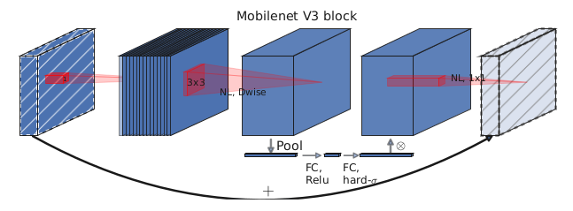
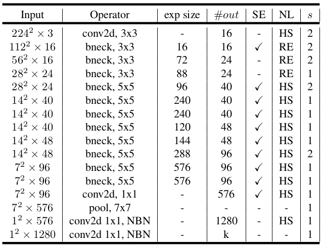
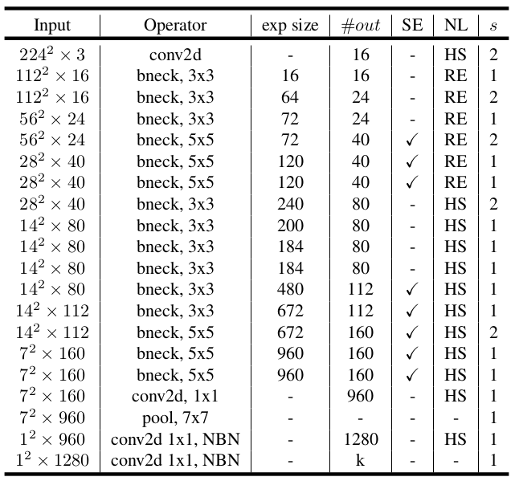
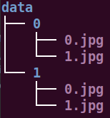

# MobileNetV3-TF
Tensorflow implementation for two new MobileNetV3 models, these models can be use in classification、detection and segmentation task at so on.  
For detail info please reference the paper "Searching for MobileNetV3".

### Mobilenet V3 block

### MobileNetV3-Small-Spec

### MobileNetV3-Large-Spec

## dependencies
- tensorflow >= r1.14
- python 3.6.x
- numpy

## prepare datasets
1. firstly, structure your datasets like below:  

2. secondly, convert your datasets to tfrecords format.

## training
when well done config the arguments run 'python train_nets.py'

## testing
when well done config the arguments run 'python test_nets.py'

## References
1. [Searching for MobileNetV3](https://arxiv.org/abs/1905.02244)
2. [TensorFlow Core r2.0](https://tensorflow.google.cn/api_docs/python/tf?hl=zh-cn)